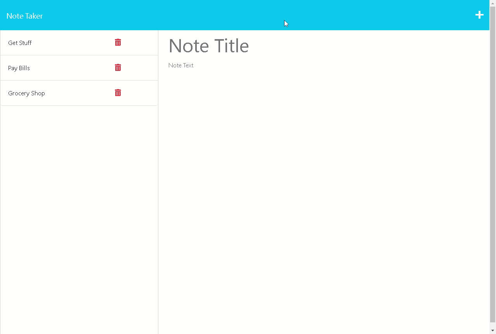

# Express Note Taking

## Description

Allows the user to write and save notes

Organize your thoughts and keep track of tasks you need to complete

## Table of Contents

- [Installation](#installation)
- [Usage](#usage)
- [License](#license)

## Installation

No installation required thanks to [Heroku](https://dashboard.heroku.com/)

## Usage

When you open the [Express Note Taker](https://salty-temple-00241.herokuapp.com/), click on the `Get Started` button

You will be directed to the note taking app

You can then enter a title and note and press the save icon in the top right corner

Your note will be stored with the ability to view it later or delete unwanted notes

The following gif will demonstrate this apps functionality

---

---

## License

This app is licensed under the [MIT License](./LICENSE)

## How to Contribute

Reach out on [GitHub](https://github.com/Tooboi)
